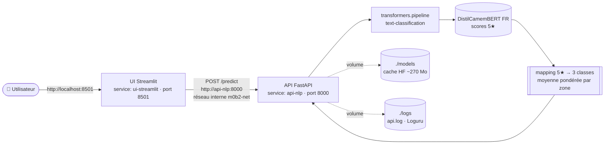

# 🍆 Aubergine Hôtels — Service de qualification du sentiment FR

Stack **Docker Compose** à 2 services qui qualifie le sentiment de reviews
clients en français. Une **API NLP** (FastAPI + Hugging Face) sert le modèle
**DistilCamemBERT**, et une **UI Streamlit** permet de tester une review d'un
clic.

Le modèle produit nativement une note **5 étoiles** (`1 star` … `5 stars`) ;
le service applique un **mapping métier 5★ → 3 classes** (`négatif` / `neutre`
/ `positif`) adapté au besoin d'Aubergine Hôtels.

- **Orchestration** : Docker Compose (2 services + healthcheck + réseau interne)
- **API** : FastAPI (Python 3.11) · doc interactive Swagger sur `/docs`
- **Modèle** : [`cmarkea/distilcamembert-base-sentiment`](https://huggingface.co/cmarkea/distilcamembert-base-sentiment) — DistilCamemBERT FR (~68 M params, ~270 Mo)
- **UI** : Streamlit (appel HTTP via `httpx`)

---

## 🏗️ Architecture

Deux conteneurs sur un **réseau privé Docker** (`m0b2-net`). L'utilisateur
n'accède qu'à l'UI ; l'UI parle à l'API par le **nom de service**
(`http://api-nlp:8000`), pas par `localhost`. Deux volumes persistent le cache
du modèle et les logs entre les redémarrages.



| Service | Rôle | Port hôte | Réseau |
|---|---|---|---|
| `api-nlp` | FastAPI + transformers, sert le modèle | `8000` | `m0b2-net` |
| `ui-streamlit` | UI utilisateur, consomme l'API | `8501` | `m0b2-net` |

---

## 🚀 Démarrage (3 commandes)

> Pré-requis : **Docker Desktop ≥ 4.0** (Compose v2 intégré).

```bash
# 1. Configurer l'environnement
cp .env.example .env

# 2. Construire et lancer la stack
docker compose up --build

# 3. Vérifier
curl http://localhost:8000/health     # API NLP → {"status":"ok","model_loaded":true}
# puis ouvrir http://localhost:8501    # UI Streamlit
```

À l'arrêt : `Ctrl+C` puis `docker compose down`. Les volumes `models/` et
`logs/` sont conservés — le modèle HF n'est **pas** re-téléchargé au prochain
`up`.

> ⏱️ Le **1ᵉʳ démarrage** prend 3-5 min (build) + 1-3 min (download du modèle
> ~270 Mo). Les démarrages suivants sont < 30 s grâce au cache volume
> `models/`.

---

## 📡 Endpoints

### `GET /health`
Santé du service. Confirme que le pipeline est chargé en mémoire.

**Réponse `200`**
```json
{ "status": "ok", "model_loaded": true }
```

### `GET /info`
Métadonnées du service (modèle, classes natives/cibles, longueur max).

**Réponse `200`**
```json
{
  "service": "FastIA Aubergine — sentiment FR",
  "model_name": "cmarkea/distilcamembert-base-sentiment",
  "native_classes": ["1 star", "2 stars", "3 stars", "4 stars", "5 stars"],
  "target_classes": ["négatif", "neutre", "positif"],
  "max_text_length": 2000
}
```

### `POST /predict`
Classifie une review FR en 3 classes métier.

**Corps de la requête (`application/json`)**

| Champ | Type | Contraintes |
|---|---|---|
| `texte` | string | non vide, 1 à `MAX_TEXT_LENGTH` (2000) caractères |

**Exemple de requête**
```bash
curl -X POST http://localhost:8000/predict \
  -H "Content-Type: application/json" \
  -d '{"texte": "Personnel charmant, chambre impeccable, on reviendra !"}'
```

**Réponse `200`**
```json
{
  "sentiment": "positif",
  "scores_5_stars": {
    "5 stars": 0.5549,
    "4 stars": 0.3940,
    "3 stars": 0.0445,
    "2 stars": 0.0049,
    "1 star": 0.0017
  },
  "model_name": "cmarkea/distilcamembert-base-sentiment",
  "latence_ms": 39.9
}
```

- **`422`** : texte vide / uniquement des espaces / trop long → validation
  Pydantic, avant tout traitement.

> 💡 Le plus simple pour tester : <http://localhost:8000/docs> → `POST /predict`
> → « Try it out ».

---

## 🧠 Mapping 5★ → 3 classes & justification

Le modèle sort 5 probabilités (une par étoile). Le métier veut 3 classes. Le
mapping est implémenté dans `services/api-nlp/app/inference.py`
(`map_stars_to_sentiment`).

### La stratégie : moyenne pondérée par zone

Plutôt que de prendre brutalement l'étoile la plus probable (`argmax`), on
calcule la **moyenne de probabilité de chaque zone de sentiment**, puis on
retient la zone gagnante :

```python
mean_neg    = moyenne(1★, 2★)
mean_neutre = moyenne(2★, 3★, 4★)
mean_pos    = moyenne(4★, 5★)
sentiment   = argmax(mean_neg, mean_neutre, mean_pos)
```

Les zones **se chevauchent volontairement** (2★ et 4★ comptent dans deux
groupes) : ces notes sont intrinsèquement ambivalentes, le chevauchement
traduit cette réalité.

### Pourquoi pas un simple `argmax` sur 5 étoiles ?

Parce que l'`argmax` brut est **fragile quand la masse de probabilité d'un
sentiment se répartit sur deux étoiles voisines**. Contre-exemple réel :

```
1★ = 0.30   2★ = 0.07   3★ = 0.08   4★ = 0.27   5★ = 0.28
```

- **Argmax brut** → `1★` gagne (0.30) → classé **négatif** ❌, alors que
  0.27 + 0.28 = **0.55** de masse est clairement côté positif.
- **Moyenne par zone** :
  - négatif = (0.30 + 0.07) / 2 = **0.185**
  - neutre  = (0.07 + 0.08 + 0.27) / 3 = **0.14**
  - positif = (0.27 + 0.28) / 2 = **0.275** ✅ → **gagne**

Deux étoiles adjacentes modérément hautes **battent un pic isolé** : le pic
sur 1★ est « dilué » par la moyenne avec son voisin faible. On raisonne sur la
**masse régionale d'un sentiment**, ce qui **résiste aux pics aberrants
isolés**.

### Portée et limites

Ce mapping corrige les erreurs **d'agrégation** (5★ → 3 classes). Il **ne
corrige pas** les erreurs **sémantiques** du modèle lui-même : si
DistilCamemBERT met sincèrement 0.85 sur 5★ pour une review ironique, aucun
mapping ne peut le rattraper. Ces cas-là sont traités dans la section
[🔍 Analyse des reviews mal classées](#-analyse-des-reviews-mal-classées).

### Arbitrage métier (coût des erreurs)

Pour Aubergine Hôtels, **un faux positif coûte plus cher qu'un faux négatif** :
classer « positif » une review en réalité négative revient à **ignorer un
client mécontent** — qui part à la concurrence et laisse un avis public
négatif. À l'inverse, escalader par excès de prudence une review neutre (faux
négatif) ne coûte qu'un peu d'attention humaine. Le mapping privilégie donc la
**détection des signaux négatifs** plutôt que l'optimisme.

---

## 🤖 Pourquoi DistilCamemBERT et pas un LLM (GPT-4) ?

Le client pourrait demander : « pourquoi ne pas appeler un gros LLM ? ».
Réponse appuyée sur ce qu'on observe sur ce service :

| Critère | DistilCamemBERT (ce service) | LLM type GPT-4 (API) |
|---|---|---|
| **Latence** | ~40 ms par review (CPU local) | 500 ms – plusieurs s (réseau + génération) |
| **Taille / coût infra** | ~270 Mo, tourne sur CPU, **gratuit** | hébergé chez un tiers, **facturé au token** |
| **Transparence** | scores 5★ bruts exposés → décision **explicable et auditable** | sortie en texte, raisonnement opaque |
| **Confidentialité** | reviews traitées **en local**, rien ne sort | données envoyées à un tiers |
| **Spécialisation** | entraîné spécifiquement sur du **sentiment FR** | généraliste, à « prompter » |

Pour une tâche **fermée, répétitive et à fort volume** (classer du sentiment),
un petit modèle spécialisé est **plus rapide, moins cher, plus transparent et
plus respectueux des données** qu'un LLM généraliste. Le LLM resterait
pertinent pour des tâches ouvertes (résumé, extraction de thèmes libres), pas
pour ce besoin précis.

---


## 🐳 Docker Compose

La stack est définie dans `docker-compose.yml` :

- **`api-nlp`** : build depuis `services/api-nlp`, port `8000`, `env_file: .env`,
  volumes `./models` (cache HF) et `./logs` (Loguru), **healthcheck** sur
  `/health` (`start_period: 40s` pour laisser le modèle charger).
- **`ui-streamlit`** : build depuis `services/ui-streamlit`, port `8501`,
  `API_URL=http://api-nlp:8000`, `depends_on: api-nlp`.
- **`m0b2-net`** : réseau bridge interne partagé par les 2 services.

**Quand faut-il rebuild ?** Le code Python est `COPY` dans l'image (pas
bind-mount). Donc toute modif de `app/` ou de `requirements.txt` nécessite :

```bash
docker compose up --build
```

Les modifs de `docker-compose.yml` (ports, env, volumes) demandent un
`docker compose down && docker compose up`.

---

## 🧪 Tests

```bash
docker compose exec api-nlp pytest -v   # tests dans le conteneur API
docker compose ps                        # api-nlp doit être (healthy)
```

---

## 📁 Structure

```
.
├── docker-compose.yml            # 2 services + healthcheck + réseau + volumes
├── .env.example                  # variables d'environnement (à copier en .env)
├── services/
│   ├── api-nlp/                  # API FastAPI + transformers
│   │   ├── Dockerfile
│   │   ├── requirements.txt
│   │   └── app/
│   │       ├── main.py           # routes (lifespan + /health + /info + /predict) + Loguru
│   │       ├── schemas.py        # schémas Pydantic (ReviewIn / SentimentOut / …)
│   │       └── inference.py      # inférence + mapping 5★ → 3 classes
│   └── ui-streamlit/             # UI utilisateur
│       ├── Dockerfile
│       ├── requirements.txt
│       └── app.py                # UI : appel httpx /predict + affichage coloré
├── data/
│   └── sample_reviews.csv        # 30 reviews FR fictives (Aubergine Hôtels)
├── postman/
│   └── M0-B2_collection.json     # collection Postman
├── models/                       # cache HF (volume, persisté)
└── logs/                         # api.log Loguru (volume, persisté)
```

---

## ⚙️ Configuration & journalisation

**Variables d'environnement** (fichier `.env`, injecté dans `api-nlp`) :

| Variable | Défaut | Usage |
|---|---|---|
| `MODEL_NAME_HF` | `cmarkea/distilcamembert-base-sentiment` | Modèle HF à charger |
| `MAX_TEXT_LENGTH` | `2000` | Longueur max du texte (validation Pydantic) |

**Modèle** : chargé **une seule fois au démarrage** (lifespan FastAPI) puis
réutilisé à chaque requête. Politique **fail-fast** : si le chargement échoue,
le conteneur sort en erreur et passe `unhealthy` — pas d'API zombie.

**Logs** (Loguru) : écrits en console **et** dans `logs/api.log` (rotation
**5 Mo**, rétention **7 jours**, compression **zip**, écriture non bloquante
via `enqueue`). Le dossier `logs/` est monté en volume et persiste sur l'hôte.

---

## 🆘 Dépannage

| Symptôme | Cause probable | Solution |
|---|---|---|
| `docker compose up` long au 1ᵉʳ run | build + download modèle (~270 Mo) | patienter 3-5 min, c'est normal |
| L'UI affiche « API non branchée » | appel HTTP non implémenté | brancher `app.py` (UI) |
| `Connection refused` depuis l'UI | mauvaise URL | utiliser `http://api-nlp:8000`, **pas** `localhost` |
| `/predict` renvoie 501 | `inference.py` non implémenté | implémenter `predict_sentiment` |
| `ModuleNotFoundError` au runtime | image pas rebuild après modif deps | `docker compose build --no-cache api-nlp` |
| Service `unhealthy` après 2 min | échec chargement modèle (réseau/RAM) | `docker compose logs api-nlp` |
| Port 8000 ou 8501 déjà pris | un autre service l'occupe | libérer le port ou adapter le mapping dans `docker-compose.yml` |

Logs en temps réel : `docker compose logs -f api-nlp`.